# Sección 1. Fundamentos: filtrado y agregación


## Pregunta 1 — Catálogo comercial activo

**Enunciado:** El equipo de ventas prepara la tarifa de la próxima campaña y necesita el catálogo depurado.

Obtén los productos que **no** están descatalogados y cuyo precio unitario esté entre 10 y 50 euros, ambos incluidos. Muestra el nombre del producto y su precio redondeado a dos decimales, ordenado de mayor a menor precio.

**Consulta:**

```sql
SELECT product_name AS producto,
       ROUND(unit_price::numeric, 2) AS precio
FROM products
WHERE discontinued = 0 
  AND unit_price BETWEEN 10 AND 50
ORDER BY precio DESC;
```

**Resultado:**

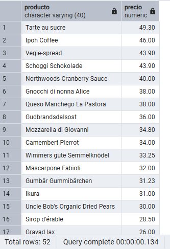

**Comentario:** Para resolver este ejercicio, usé ``` WHERE discontinued = 0 ``` para asegurarme de filtrar solo los productos que siguen activos (0 = false; 1 = true). Para el "precio unitario esté entre 10 y 50 euros" lo mejor es usar el operador ```BETWEEN```. Al final simplemente hay que ordenar de mayor a menor precio usando el as que asignamos antes ```ROUND(unit_price::numeric, 2) AS precio```.

***
## Pregunta 2 — Concentración geográfica de la cartera

**Enunciado:** Dirección quiere saber en qué mercados está realmente concentrada la base de clientes antes de decidir dónde abrir delegación.

Cuenta cuántos clientes hay en cada país y muestra únicamente aquellos países con **5 o más clientes**, ordenados de mayor a menor. Indica también cuántas ciudades distintas hay en cada uno de esos países.

**Consulta:**

```sql
SELECT country AS pais,
       COUNT(customer_id) AS num_clientes,
       COUNT(DISTINCT city) AS num_ciudades
FROM customers
GROUP BY country
HAVING COUNT(customer_id) >= 5
ORDER BY num_clientes DESC;
```

**Resultado:**

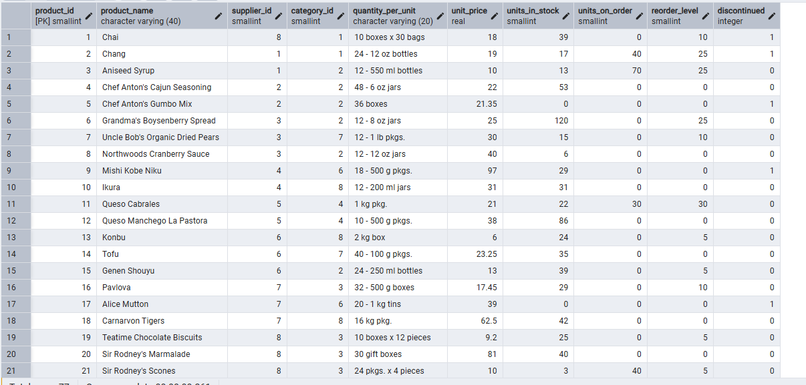

**Comentario:** Para resolver este ejercicio, usé `GROUP BY country` para agrupar los registros por país. Para no contar la misma ciudad dos veces lo mejor es usar `COUNT(DISTINCT city)`. Al final simplemente hay que filtrar los que tienen 5 o más clientes usando `HAVING COUNT(customer_id) >= 5` porque la condición se aplica después de haber contado.

## Pregunta 3 — Alerta de reposición

**Enunciado:** Logística necesita detectar qué referencias están en riesgo de rotura de stock.

Localiza los productos activos cuyas unidades en stock sean **inferiores o iguales** a su nivel de reposición. Muestra el nombre, las unidades en stock, el nivel de reposición, las unidades ya pedidas al proveedor y una columna de texto que indique `'CRÍTICO'` cuando el stock sea 0 y `'AVISO'` en el resto de casos.

**Consulta:**

```sql
SELECT product_name AS producto,
       units_in_stock AS stock,
       reorder_level AS nivel_reposicion,
       units_on_order AS pedido_a_proveedor,
       CASE 
           WHEN units_in_stock = 0 THEN 'CRÍTICO'
           ELSE 'AVISO'
       END AS situacion
FROM products
WHERE discontinued = 0 
  AND units_in_stock <= reorder_level;
```

**Resultado:**

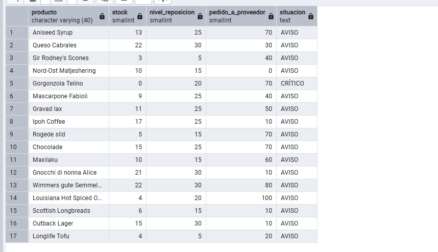

**Comentario:** Para resolver este ejercicio, usé `WHERE discontinued = 0 AND units_in_stock <= reorder_level` para asegurarme de filtrar los productos activos que están bajo mínimos. Para crear la columna de "situación" lo mejor es usar el condicional `CASE WHEN`(Funciona igual que un if - else) devolviendo 'CRÍTICO' si es 0, y 'AVISO' con el `ELSE`. Al final simplemente hay que mostrar los campos solicitados en el SELECT.

# Sección 2. INNER JOIN

## Pregunta 4 — Ficha completa de producto

**Enunciado:** Marketing va a rehacer el catálogo impreso y necesita cada producto con su categoría y los datos de contacto de quien lo suministra.

Para los productos suministrados por empresas de **Italia, Francia o España**, muestra el nombre del producto, el nombre de la categoría, el nombre del proveedor, su país y su ciudad. Ordena por país y, dentro de cada país, por nombre de producto.

**Consulta:**

```sql
SELECT p.product_name AS producto,
       c.category_name AS categoria,
       s.company_name AS proveedor,
       s.country AS pais,
       s.city AS ciudad
FROM products p
INNER JOIN categories c ON p.category_id = c.category_id
INNER JOIN suppliers s ON p.supplier_id = s.supplier_id
WHERE s.country IN ('Italy', 'France', 'Spain')
ORDER BY s.country, p.product_name;
```

**Resultado:**

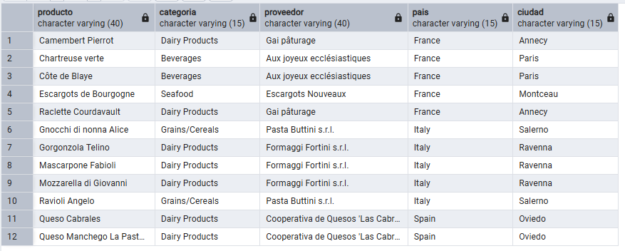


**Comentario:** Para resolver este ejercicio, usé `INNER JOIN` para unir las tablas de productos, categorías y proveedores. Para filtrar por varios países a la vez lo mejor es usar el operador `IN ('Italy', 'France', 'Spain')`. Al final simplemente hay que ordenar primero por país y luego por producto usando `ORDER BY s.country, p.product_name`.


## Pregunta 5 — Detalle valorizado de un pedido

**Enunciado:** Atención al cliente recibe una reclamación sobre el pedido **10248** y necesita reconstruir la factura línea a línea.

Muestra, para ese pedido, el nombre del producto, el precio unitario aplicado, la cantidad, el descuento y el importe final de cada línea. Añade el nombre del cliente y la fecha del pedido.

**Consulta:**

```sql
SELECT c.company_name AS cliente,
       o.order_date AS fecha_pedido,
       p.product_name AS producto,
       od.unit_price AS precio_unitario,
       od.quantity AS cantidad,
       od.discount AS descuento,
       ROUND((od.unit_price::numeric) * od.quantity * (1 - od.discount::numeric), 2) AS importe_linea
FROM orders o
INNER JOIN customers c USING (customer_id)
INNER JOIN order_details od USING (order_id)
INNER JOIN products p USING (product_id)
WHERE o.order_id = 10248;
```

**Resultado:**

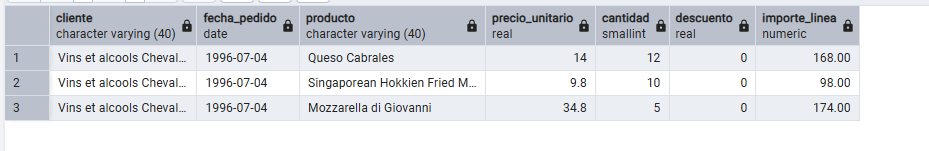

**Comentario:** Para resolver este ejercicio, usé `USING(order_id)` y `USING(product_id)`(es lo mismo que `INNER JOIN customers c ON o.customer_id = c.customer_id`) para unir las tablas. Para este tipo de uniones donde la columna se llama exactamente igual en ambas tablas lo mejor es usar `USING` porque queda más limpio. Al final simplemente hay que calcular el importe final aplicando la fórmula matemática `ROUND((od.unit_price::numeric) * od.quantity * (1 - od.discount::numeric), 2)`.


## Pregunta 6 — Ranking de categorías por facturación

**Enunciado:** Comité de dirección: ¿qué familias de producto sostienen realmente el negocio?

Calcula la facturación total de cada categoría durante toda la historia de la compañía. Muestra el nombre de la categoría, el número de líneas de pedido que ha generado, el número de productos distintos vendidos y la facturación total. Incluye únicamente las categorías que superen los **100.000 euros** de facturación, ordenadas de mayor a menor.

**Consulta:**

```sql
SELECT c.category_name AS categoria,
       COUNT(od.order_id) AS num_lineas,
       COUNT(DISTINCT od.product_id) AS num_productos,
       SUM(ROUND((od.unit_price::numeric) * od.quantity * (1 - od.discount::numeric), 2)) AS facturacion
FROM categories c
INNER JOIN products p USING (category_id)
INNER JOIN order_details od USING (product_id)
GROUP BY c.category_name
HAVING SUM(ROUND((od.unit_price::numeric) * od.quantity * (1 - od.discount::numeric), 2)) > 100000
ORDER BY facturacion DESC;
```

**Resultado:**

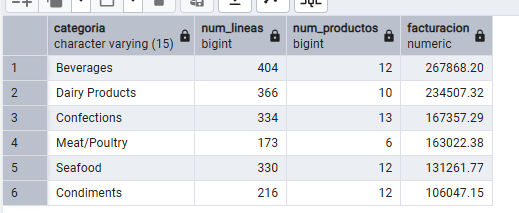


**Comentario:** Para resolver este ejercicio, usé `GROUP BY c.category_name` para agrupar por categoría. Para contar los productos únicos lo mejor es usar `COUNT(DISTINCT od.product_id)`. Al final simplemente hay que filtrar las categorías que superan los 100.000 euros usando `HAVING` (`WHERE` no funciona al hacer `GROUP BY`) y repitiendo la expresión completa del SUM para evitar errores con el alias.


# Sección 3. Uniones externas, reflexivas y cruzadas

## Pregunta 7 — Clientes sin actividad comercial

**Enunciado:** Dirección comercial sospecha que hay cuentas abiertas que nunca han llegado a comprar.

Lista **todos** los clientes con el número de pedidos que ha realizado cada uno y la fecha de su último pedido. Los clientes sin ningún pedido deben aparecer igualmente, con un 0 en el conteo y el texto `'SIN PEDIDOS'` en lugar de la fecha. Ordena de forma que los clientes inactivos aparezcan primero.

**Consulta:**

```sql
SELECT c.company_name AS cliente,
       c.country AS pais,
       COUNT(o.order_id) AS num_pedidos,
       COALESCE(TO_CHAR(MAX(o.order_date), 'YYYY-MM-DD'), 'SIN PEDIDOS') AS ultimo_pedido
FROM customers c
LEFT JOIN orders o USING (customer_id)
GROUP BY c.company_name, c.country
ORDER BY num_pedidos ASC;
```

**Resultado:**

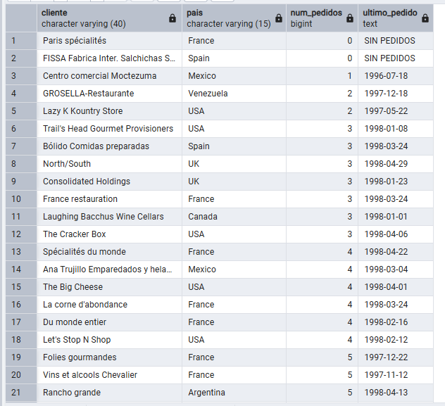

**Comentario:** Para resolver este ejercicio, usé `LEFT JOIN` desde customers para asegurarme de sacar todos los clientes, incluso los que no tienen pedidos. Para contar los pedidos lo mejor es usar `COUNT(o.order_id)` que devuelve 0 si es nulo. Al final simplemente hay que sustituir la fecha vacía usando la función `COALESCE(TO_CHAR(MAX(o.order_date), 'YYYY-MM-DD'), 'SIN PEDIDOS')`.


## Pregunta 8 — Organigrama de la fuerza de ventas

**Enunciado:** Recursos Humanos necesita el organigrama del departamento comercial en formato tabla.

Muestra cada empleado con su nombre completo, su cargo, el nombre completo de la persona a la que reporta y el cargo de esa persona. El empleado que no reporta a nadie debe aparecer también, con el texto `'DIRECCIÓN GENERAL'` en el campo del responsable.

**Consulta:**

```sql
SELECT e.first_name || ' ' || e.last_name AS empleado,
       e.title AS cargo,
       COALESCE(j.first_name || ' ' || j.last_name, 'DIRECCIÓN GENERAL') AS responsable,
       j.title AS cargo_responsable
FROM employees e
LEFT JOIN employees j ON e.reports_to = j.employee_id;
```

**Resultado:**

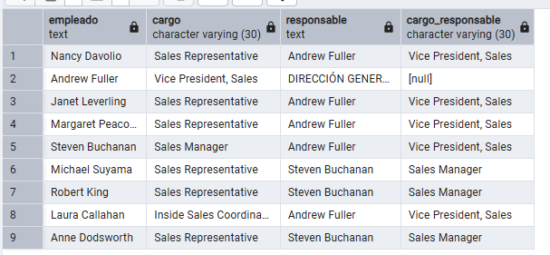

**Comentario:** Para resolver este ejercicio, usé `LEFT JOIN` para unir la tabla employees consigo misma asignándole los alias `e` (empleado) y `j` (jefe) sacando también los posibles valores nulos. Para juntar nombre y apellido lo mejor es usar el operador de concatenación `||`. Al final simplemente hay que poner 'DIRECCIÓN GENERAL' al que tiene null usando `COALESCE(..., 'DIRECCIÓN GENERAL')`.


## Pregunta 9 — Rejilla de cobertura categoría × año

**Enunciado:** Control de gestión quiere una rejilla completa de facturación por categoría y año, **sin huecos**: si una categoría no vendió nada en un año concreto, debe aparecer con un 0, no desaparecer de la tabla.

Genera todas las combinaciones posibles de las 8 categorías con los 3 años del histórico (24 filas) y asocia a cada combinación su facturación. Ordena por categoría y año.

**Consulta:**

```sql
WITH anios AS (
    SELECT UNNEST(ARRAY[1996, 1997, 1998]) AS anio
),
ventas AS (
    SELECT p.category_id,
           EXTRACT(YEAR FROM o.order_date) AS anio,
           SUM(ROUND((od.unit_price::numeric) * od.quantity * (1 - od.discount::numeric), 2)) AS total
    FROM orders o
    JOIN order_details od USING (order_id)
    JOIN products p USING (product_id)
    GROUP BY 1, 2
)
SELECT c.category_name AS categoria,
       a.anio,
       COALESCE(v.total, 0) AS facturacion
FROM categories c
CROSS JOIN anios a
LEFT JOIN ventas v ON c.category_id = v.category_id AND a.anio = v.anio
ORDER BY c.category_name, a.anio;
```

**Resultado:**

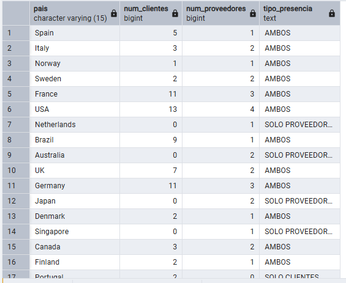

**Comentario:** Para resolver este ejercicio, primero preparé las piezas del puzzle usando el bloque WITH para aislar los años y pre-calcular las ventas. Después, construí el esqueleto del informe mezclando todas las categorías con todos los años usando un CROSS JOIN, asegurando así que se generaran las 24 filas posibles. A ese esqueleto inquebrantable le pegué los datos reales usando un LEFT JOIN. Como las categorías que no vendieron nada en un año específico generan huecos vacíos tras la unión, lo mejor es usar COALESCE(v.total, 0) para maquillar el resultado e imprimir un 0 en lugar del valor nulo.


## Pregunta 10 — Mapa de países: clientes frente a proveedores

**Enunciado:** Expansión internacional quiere una única tabla que muestre, para cada país en el que la compañía tiene presencia, cuántos clientes y cuántos proveedores hay. Deben aparecer los países que solo tienen clientes, los que solo tienen proveedores y los que tienen ambos.

**Consulta:**

```sql
WITH clientes_pais AS (
    SELECT country, COUNT(customer_id) AS num_clientes 
    FROM customers GROUP BY country
),
proveedores_pais AS (
    SELECT country, COUNT(supplier_id) AS num_proveedores 
    FROM suppliers GROUP BY country
)
SELECT COALESCE(c.country, p.country) AS pais,
       COALESCE(c.num_clientes, 0) AS num_clientes,
       COALESCE(p.num_proveedores, 0) AS num_proveedores,
       CASE 
           WHEN p.num_proveedores IS NULL THEN 'SOLO CLIENTES'
           WHEN c.num_clientes IS NULL THEN 'SOLO PROVEEDORES'
           ELSE 'AMBOS'
       END AS tipo_presencia
FROM clientes_pais c
FULL JOIN proveedores_pais p USING (country);
```

**Resultado:**


**Comentario:** Para resolver este ejercicio, primero preparé las piezas del puzzle usando el bloque WITH para agrupar y contar por separado los clientes y proveedores de cada país. Después, junté ambas listas usando un FULL JOIN para no descartar absolutamente ningún país, existiera solo en una tabla o en ambas. Para clasificar el tipo de presencia, lo mejor es usar un CASE WHEN que evalúe los huecos generados por la unión (IS NULL) e imprima la etiqueta correspondiente ('SOLO CLIENTES', 'SOLO PROVEEDORES' o 'AMBOS'). Al final, simplemente hay que maquillar el resultado usando COALESCE para que los conteos vacíos se muestren como un 0 en el informe.


# Sección 4. Operadores de conjunto

## Pregunta 11 — Directorio unificado de contactos

**Enunciado:** Sistemas va a migrar el CRM y necesita una exportación única con todos los contactos de la compañía, vengan de donde vengan.

Construye una sola tabla que reúna los contactos de clientes, los de proveedores y los empleados. Cada fila debe indicar el origen (`'CLIENTE'`, `'PROVEEDOR'`, `'EMPLEADO'`), el nombre de la persona de contacto **en mayúsculas**, la organización a la que pertenece, la ciudad y el país. Para los empleados, la organización es el literal `'NORTHWIND TRADERS'` y el nombre de contacto se forma concatenando nombre y apellidos.

Ordena por origen y luego por país.

**Consulta:**

```sql
SELECT 'CLIENTE' AS origen, UPPER(contact_name) AS contacto, company_name AS organizacion, city AS ciudad, country AS pais FROM customers
UNION ALL
SELECT 'PROVEEDOR', UPPER(contact_name), company_name, city, country FROM suppliers
UNION ALL
SELECT 'EMPLEADO', UPPER(first_name || ' ' || last_name), 'NORTHWIND TRADERS', city, country FROM employees
ORDER BY origen, pais;
```

**Resultado:**

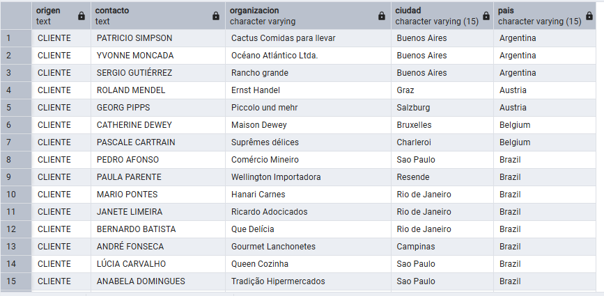

**Comentario:** Para resolver este ejercicio, usé `UNION ALL` para apilar los tres SELECTs directamente. Para asegurar el formato del nombre en mayúsculas lo mejor es usar la función `UPPER()`. Al final simplemente hay que ordenar el resultado global usando `ORDER BY origen, pais`.


## Pregunta 12 — Mercados con desequilibrio

**Enunciado:** Compras y Ventas mantienen una discusión recurrente: ¿en qué países vendemos sin tener proveedor local, y en cuáles coincidimos?

Resuelve las dos preguntas en dos consultas independientes:

**a)** Países donde hay clientes pero **ningún** proveedor.
**b)** Países donde hay **a la vez** clientes y proveedores.

Ordena ambos resultados alfabéticamente.

**Consulta a (Solo clientes):**

```sql
SELECT country AS pais FROM customers
EXCEPT
SELECT country FROM suppliers
ORDER BY pais;
```
**Resultado:**

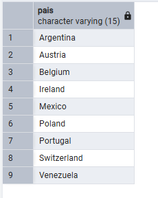
**Consulta b (Ambos):**

```sql
SELECT country AS pais FROM customers
INTERSECT
SELECT country FROM suppliers
ORDER BY pais;
```

**Resultado:**

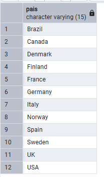


**Comentario:** Para resolver este ejercicio, usé `EXCEPT` en la primera consulta para restarle los países de proveedores a la lista de clientes. Para la segunda consulta lo mejor es usar `INTERSECT` porque extrae directamente los países que comparten ambas tablas. Al final simplemente hay que ordenar ambas con `ORDER BY pais`.


# Sección 5. Subconsultas

## Pregunta 13 — Clientes que nunca han comprado pescado

**Enunciado:** El responsable de la categoría Seafood quiere una lista de cuentas sobre las que hacer campaña de captación.

Localiza los clientes que **nunca** han incluido un producto de la categoría `'Seafood'` en ninguno de sus pedidos. Muestra el nombre del cliente, su país y el número total de pedidos que sí ha realizado, de mayor a menor.

**Consulta:**

```sql
SELECT c.company_name AS cliente,
       c.country AS pais,
       COUNT(o.order_id) AS pedidos_realizados
FROM customers c
LEFT JOIN orders o USING (customer_id)
WHERE NOT EXISTS (
    SELECT 1 
    FROM orders o2 
    JOIN order_details od USING (order_id)
    JOIN products p USING (product_id)
    JOIN categories cat USING (category_id)
    WHERE o2.customer_id = c.customer_id 
      AND cat.category_name = 'Seafood'
)
GROUP BY c.company_name, c.country
ORDER BY pedidos_realizados DESC;
```

**Resultado:**


**Comentario:** Para resolver este ejercicio, usé `WHERE NOT EXISTS` con una subconsulta para asegurarme de descartar a los clientes que tienen pedidos de 'Seafood'. Para contar sus ventas reales lo mejor es agrupar en la consulta principal y usar `COUNT(o.order_id)`. Al final simplemente hay que ordenar los resultados descendentemente con `ORDER BY pedidos_realizados DESC`.


